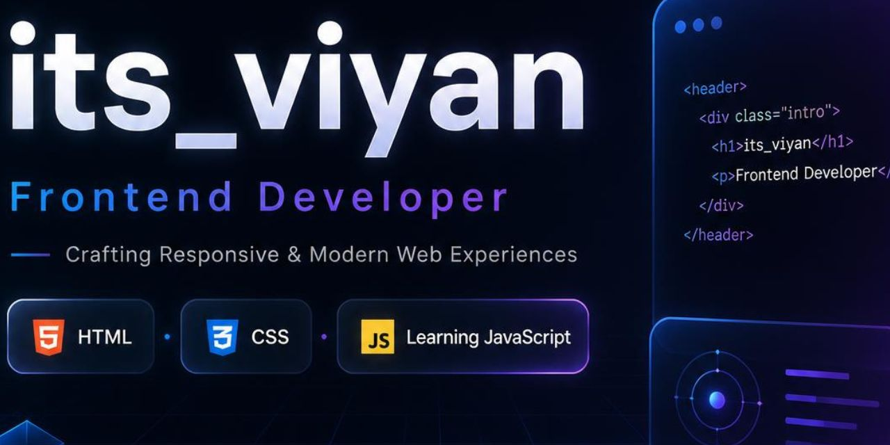

<p align="center">
  
</p>

<h1 align="center">Hi 👋 I'm Viyan</h1>

<h3 align="center">Frontend Developer • UI Enthusiast • Web Creator</h3>

<p align="center">
  Building clean, responsive and modern web experiences with creativity and code.
</p>

<p align="center">
  

<p align="center">
  

---

## ✨ About Me


---

## 🛠️ Tech Stack

<p align="center">


### Currently Exploring

<p align="center">

https://skillicons.dev/icons?i=react,figma,nodejs&theme=light

</p>

---

## 🚀 Featured Projects

<div align="center">

<a href="https://itsviyan.netlify.app">
  
  

</div>

### 🌐 Contact Website

> A modern contact website featuring a clean interface, responsive design, and smooth user experience.

🔗 **Live Demo:** https://itsviyan.netlify.app

---

### 🎵 Haven Music Player

> A sleek music player focused on beautiful UI, intuitive controls, and modern design principles.

🔗 **Live Demo:** https://havenmusic.netlify.app

---

## 📊 GitHub Analytics

<p align="center">


---

## 🌱 Learning Journey

```text
▰▰▰▰▰▰▰▰▱▱ JavaScript
▰▰▰▰▰▰▰▱▱▱ Advanced CSS
▰▰▰▰▰▰▱▱▱▱ UI/UX Design
▰▰▰▰▰▱▱▱▱▱ React.js
```

---

## 🏆 GitHub Achievements

<p align="center">
  

https://github.com/Viyan852


</p>

---

<p align="center">


✨ "Design is intelligence made visible." ✨
</h3>
``
